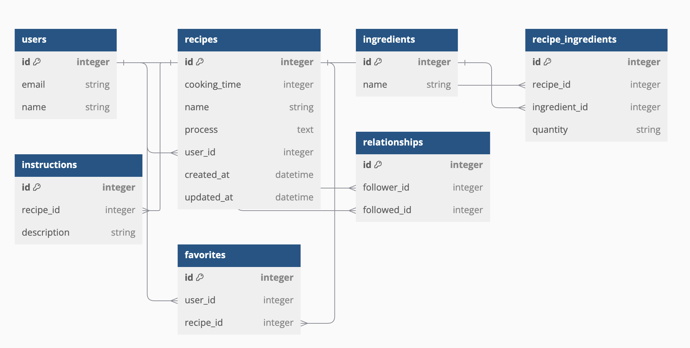

# README

[こちらのレポジトリ](https://github.com/kousei1015/recipes-front)のバックエンドAPIの部分です。本レポジトリは、レシピアプリのバックエンドをRuby on Railsで実装しており、ユーザー認証、レシピの作成・編集・削除、お気に入り機能、フォロワー機能を提供しています。

Rails APIモードで開発しており、主に使ったgemは以下の通りです。

- devise, devise_token_auth　　ユーザー認証のために使用
- kaminari　　ページネーションに使用
- jbuilder　　json形式のデータを作成するのに使用
- faker,factory_bot_rails, rspec　　テストを用いるのにしよう
- unicorn 　　本番用アプリケーションサーバーとして使用

他に使った技術としては、Active Storageを使って、ユーザーのプロフィール画像とレシピ画像をS3へ保存するようにしています。また、webサーバーにはnginxを使っています

## 機能について
こちらはレシピアプリのバックエンドです。主な機能としては
1. ユーザーの登録、ログイン機能
2. レシピの投稿、編集、削除機能
3. レシピのお気に入り機能
4. フォロー機能、フォロワー機能

大まかなER図は以下の通りです(active storageに関するテーブルは省略しています)

## バックエンドのインフラ(AWSを使いました)

- Lightsailコンテナサービス
- Lightsailデータベース(MySQLを使用)
- S3(レシピの画像、ユーザーのプロフィール画像をS3へ保存しています)

バックエンドのインフラについては、Dockerを使ってローカルの開発環境を構築していたので、AWSのコンテナサービスを使いたいと思い、今回はLightsailのコンテナサービスを利用しました。以前は、こちらのレポジトリをFargateでデプロイした経験もあり、他にもECS on EC2も選択肢にありましたが、他のサービスを調べていく内にLightsailもコンテナをサポートし、料金も月7ドルからと安価であること、そしてデプロイが非常に簡単であることを知り、今回はLightsailを採用しました。Lightsailのコンテナサービスを使ったデプロイに関しては情報が少ないと感じましたが、ECSのデプロイ経験があれば、簡単にデプロイできると思います。また、データベースについてもLightsailのサービスを利用しており、比較的安価でコストパフォーマンスが良さそうであったので採用を決めました。